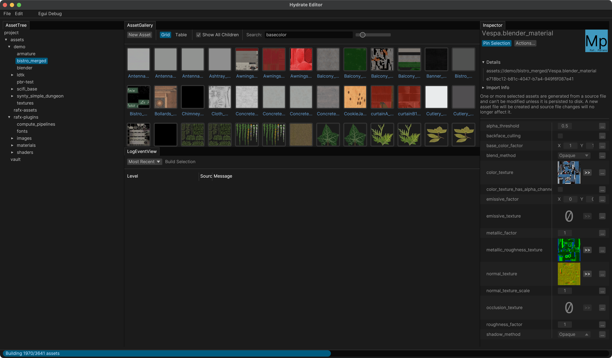

# Hydrate Quick Tour

If you're making a game, more than likely you will need to load content. Some of that content will be authored in tools like photoshop or blender, and some of the content will be specific to your engine. You might start out by exporting to common file formats like .png, .obj, etc. and using JSON to stitch the content together.

But what happens when you need to change the format of those JSON files? How do you validate that references between asset types are valid? What if you don't want to have all content loaded at all times? Hydrate provides a ready-to-go framework and set of tools to take that next step in scale.
## How Does it Work?

First, you define a schema like this:

```json
{  
  "type": "record",  
  "name": "Transform",  
  "uuid": "22ccb2e7-fabd-4782-834c-3f08fc128b67",  
  "tags": ["asset"],  
  "display_name": "Transform",
  "fields": [
    {  
      "name": "position",  
      "type": "Vec3",  
      "uuid": "0770937a-909d-4306-b7c2-eefb0ddc354a"  
    },  
    {  
      "name": "rotation",  
      "type": "Vec4",  
      "uuid": "a22b4e4a-e722-422c-bcf8-d1e0b3698d25"  
    },  
    {  
      "name": "scale",  
      "type": "Vec3",  
      "uuid": "fb60da64-9374-4810-af97-9b853a587dd8"  
    }
  ]  
}
```

Some things to call out:
 - A struct-like schema is called a "record". It has a name and a UUID.
	 - You should generate a random UUID and never change it. (Most editors can be extended to do this on a keyboard shortcut.)
	 - The name can be changed freely, as long as the UUID stays the same.
 - Fields have names, types, and a UUID.
	 - The name/uuid should be handled similar to above. Change the name as needed, but generate the UUID once randomly and never change it.
	 - Fields can be primitives (bool, f32, etc.) or a number of special types such as enums, other records, nullable fields, dynamic arrays, dictionaries, etc.

Representing schema as data instead of code has many benefits, like avoiding unnecessary recompiles of editing tools, ability to specify additional metadata (like valid ranges for numbers), and a better story for multi-language support.
## Code Generation

While hydrate provides an API to work with data purely using field names, this can be error-prone and laborious. Hydrate provides a code generator to make working with data fast and type-safe from Rust.

A simplified example importer using the generated code might look like this:

```rust
impl Importer for TransformImporter {
	fn import_file(  
	    &self,  
	    context: ImportContext,  
	) -> PipelineResult<()> {
		let json_str = std::fs::read_to_string(context.path)?;  
		let json_data: TransformJsonFileFormat = serde_json::from_str(&json_str)?;
		  
		let transform = TransformRecord::new_builder(context.schema_set);
		transform.position().set_vec3(json_data.position)?;
		transform.rotation().set_vec4(json_data.rotation)?;
		transform.scale().set_vec3(json_data.scale)?;
		  
		context.add_default_importable(transform.into_inner()?, None);
	}
}
```

Note that changing the names of fields in schemas may require corresponding renames in code. Any saved data will be automatically schema-migrated.

Usually an importer would be loading complex formats an images or meshes. Simple data like this can be created and edited directly in the editor.
## Editing

When schema objects are flagged with the "asset" tag like in the example above, they can be created directly in the editor.

![[transform-property-edit-example.png]]

This will be stored to disk like this. **It is not meant to be edited directly**, but it is fairly friendly to reading and diffing.

```json
{
  "id": "a883cfa0-c682-4b8b-b81c-f3c5c260a819",
  "name": "test_transform2",
  "parent_dir": null,
  "root_schema": "26d57274-8eca-c415-a19e-93a27a61ee77",
  "schema_name": "Transform",
  "import_info": null,
  "build_info": {
    "file_reference_overrides": {}
  },
  "prototype": null,
  "properties": {
    "position.x": 30.0,
    "position.y": 5.0,
    "position.z": 10.0,
    "rotation.w": 1.0,
    "rotation.x": 0.0,
    "rotation.y": 0.0,
    "rotation.z": 0.0,
    "scale.x": 1.0,
    "scale.y": 1.0,
    "scale.z": 1.0
  },
  "schemas": {
    "26d57274-8eca-c415-a19e-93a27a61ee77": "...",
    "5d58a547-db37-0918-c17f-47d4bf7eca7d": "...",
    "f2fb60c0-9253-e4f4-9ee0-e1717a8bf9dd": "..."
  }
}
```

Assets can be thought of as a simple list of properties. Even containers such as nullable values, dynamic arrays and maps are flattened to a single-level key/value structure. Unset properties are left to be default values. This greatly simplifies handling for property inheritance/overrides.

Note that asset files are self-describing by including the schema they were saved with. In this example there are three schemas: the Transform, and the Vec3 and Vec4 contained in the Transform. While this incurs some storage cost, it ensures that we can **always** load data saved with previous versions of a schema.

A more interesting scenario might be defining some material with parameters and references to textures. References between assets can be set with drag-and-drop.


## Building

Hitting the build button in the bottom right produces data for consumption by the game. Thousands of assets representing GBs of data can be processed in a couple seconds.


## Loading

When an artifact is built, it produces one or more artifacts. The artifacts can be requested by UUID or symbolic name. Generally, the symbolic name of an asset will be the path.

```rust
let transform_handle: Handle<TransformArtifact> =  
    loader.load_artifact_symbol_name("assets://test_transform2");

// ...

loop {
    // The artifact, along with dependencies, will be loaded in the background
    // If the asset changes and is rebuilt, it will be reloaded in-game
	if let Some(transform) = transform_handle.artifact(loader.storage()) {  
	    println!("transform loaded {:?}", transform);  
	} else {  
	    println!("transform not loaded");  
	}
}


```

The above example data is loaded below. Thousands of individual built artifacts were loaded in about 300ms based on a single scene being requested (`assets://demo/bistro_merged/Scene.blender_prefab`)

